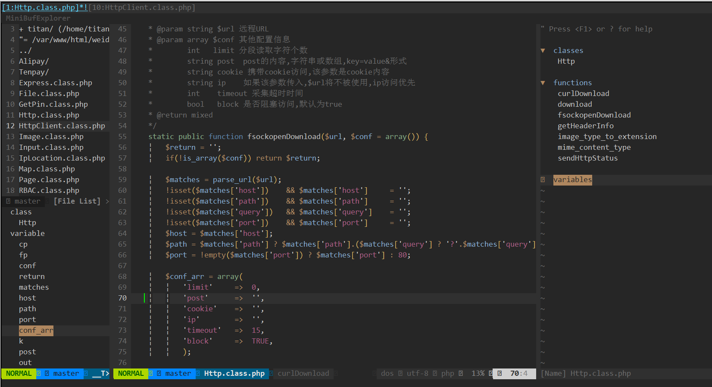

# VIM配置文件
1、Vundle

### 运行截图

### Vundle安装：
- 安装ctags：`sudo yum install ctags`
- 安装一些必备程序：`sudo yum install python-twisted xclip vim-gnome astyle python-setuptools`
- python代码格式化工具：`sudo easy_install -ZU autopep8`
- `sudo ln -s /usr/bin/ctags /usr/local/bin/ctags`
- clone配置文件：`cd ~/ && git clone https://github.com/titan-web/vim-setting.git`
- `cp ~/vim ~/.vim`
- `cp ~/.vim/.vimrc ~/`
- clone bundle 程序：`git clone https://github.com/gmarik/vundle.git ~/.vim/bundle/vundle`
- 打开vim并执行bundle程序`:BundleInstall`
- 重新打开vim即可看到效果
